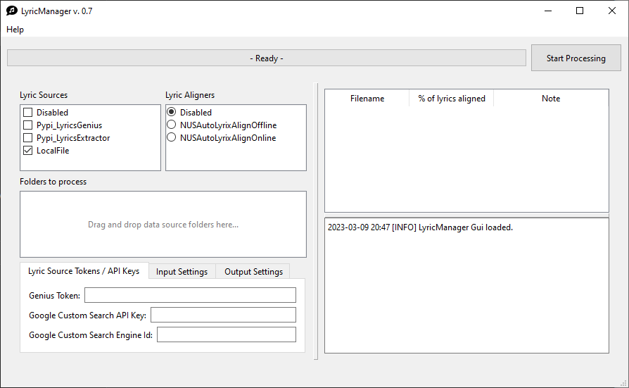

<div align="center">

<div id="user-content-toc">
  <ul>
    <summary><h1 style="display: inline-block;">Lyric Manager</h1></summary>
  </ul>
</div>
	
:speech_balloon::musical_note: **Lyric Manager is an open source, music lyric manager to align lyrics to your song collection!**

---



</div>

# :sparkles: Features

- Two interface flavors
  - Graphical-User Interface
  - Command-Line Interface
- Fetches lyrics from three sources
  - Local text file
  - Pypi lyricsgenius genius db
  - Pypi lyric_extractor using GCS
- Supports one aligner
  - NUSLyrixAutoAlign
- Generates `.json` file containing lyric structure and timing data useful for rendering lyric visuals via other tools such as [PlanMixPlay](http://www.planmixplay.com/)

# Introduction

Lyric Manager's fetches lyrics and aligns them to music. Finally, it generates a `.json` file containing lyric structure and timing data. Lyric Manager is primarily a 'glue tool' and relies heavily on external resources for both the fetching and aligning on lyrics. In other words, the tool is most functional in conjunction with other tools, some of which require a bit of setup. For more details, read the [setup section](https://github.com/Gazoo101/lyric-manager/edit/main/README.md#setup).

## Who is Lyric Manager for?

Given that Lyric Manager is a 'glue tool' and requires additional external tools to fully work, it's likely most useful for:
- Developers who want to work with audio and lyrics
- People who are keen to generate data for external tools (like [PlanMixPlay](http://www.planmixplay.com/)) to create lyric-based visuals, see video below.

<div align="center">
  <a href="https://www.youtube.com/watch?v=_J1hhTWgCXM"></a>
</div>


# Requirements

- Operating System
  - Windows 8 or newer - GUI or CLI - Lyric fetching *only* - Alignment files must be generated in Linux.
  - Ubuntu 20.04 or newer - GUI or CLI 
  - Ubuntu 18.04 - CLI only (GUI uses Qt6 which doesn't work out-of-the-box on this ubuntu version or older)
  
If running Lyric Manager directly via a Python interpreter, you'll likely need at least 3.8. It's only actively tested with 3.11 though.

# Setup

Setting up Lyric Manager itself is easy:

- Download a [binary release](https://github.com/Gazoo101/lyric-manager/releases) (Windows GUI binary only)
  - Happy to make more pre-compiled versions available if sufficient interest arises
- Install Python 3.7 or newer and then...
  - Check-out the repository, install Python package requirements via `requirements.txt`, run GUI / CLI version as needed

To get the full benefits of Lyric Manager, you'll have to configure some fetcher sources as well as an aligner.

## LyricFetcher sources

Lyric Manager supports the following sources:

- Local `.txt` file with the same name as the audio file, e.g. "Artist - Song Name.txt" would accompany "Artist - Song Name.mp3". Place this file next to your audio or in Lyric Manager's working directory.
- Genius lyrics database. An API key will be required, visit that [Genius docs](https://docs.genius.com/) for a link to generating a client access token.
- Google Custom Search API. You'll need an API Key and Engine ID of Google Custom Search JSON API which you setup. The [requirements section for the Pypi package lyrics-extractor](https://pypi.org/project/lyrics-extractor/) explains how to set this up.

## LyricAligners

Lyric Manager currently only supports one aligner:

- [NUSAutoLyrixAlign](https://github.com/chitralekha18/AutoLyrixAlign) which runs via Singularity on Linux.
  - I can confirm it works on Ubuntu 22.04 after some minor patching work.

Text below this line is out-of-date and is being revised.

---

# Input / Output

Lyric Manager uses the following input/output files, for a given `Artist - Song.mp3`:

Input / Output | Filename | Format | Description
-------------- | -------- | ------ |-------------
Input | `Artist - Song.mp3` | Audio |  Audio file for which to fetch and align lyrics
Input | `Artist - Song.txt` | Text | Text file containing lyrics for `song.mp3`, provided by you. Set `LocalFile` in `lyric_fetchers` in `settings.yaml` to use this source.
Input & Output | `Artist - Song.{fetcher}_source`, e.g. `Artist - Song.genius_source` | Json | If `lyric_fetchers` in `settings.yaml` includes `Genius` Lyric Manager will attempt to retrieve lyrics from the Genius database and generate this intermediate file.
Input & Output | `Artist - Song.{fetcher}_sanitized_text`, e.g. `Artist - Song.genius_sanitized_text` | Text | A sanitized version of the `song.txt` or `song.genius` removing non-lyric text and converting the lyrics to be more paletable for NUSAutoLyrixAlign.
Input & Output | `song.nusalaoffline` | Text | The alignment data generated by the offline version of NUSAutoLyrixAlign.
Output | `song.aligned_lyrics` | Json | Contains JSON data with timing data and supporting rendering information as detailed below.

Example contents of `song.aligned_lyrics`:

```json5
{
    // Commentary inserted for clarity (not present in actual output!)
    "schema_version": "2.0.0", // A schema version to better track improvements / breakage
    "lyric_lines": [
        // lyric_lines typically contains multiple entries, one per line in the original lyric text.
        // Lyric Manager retains the lyric format structure (i.e. which words are in which lines)
        // from the original lyrics.
        // This example includes just a single entry.
        {
            "text": "Oxy-toxins flowing,", // Text of lyric line
            "time_start": 107.82,         // Start time of full lyric line in seconds (from beginning of .mp3 file)
            "time_end": 110.43,           // End time of full lyric line in seconds (from beginning of .mp3 file)
            "lyric_words": [
                {
                    "original": "Oxy",              // Original text of single lyric word
                    "single": "Oxy",                // Modified text, expected to be more presentable as single word (see example below)
                    "word_split_char_pre": "",      // Character (if present) which is part of pre-split
                    "word_split_char_post": "-",    // Character (if present) which is part of post-split
                    "time_start": 107.82,           // Start time of word in seconds (from beginning of .mp3 file)
                    "time_end": 108.57              // End time of word in seconds (from beginning of .mp3 file)
                },
                {
                    "original": "toxins",
                    "single": "toxins",
                    "word_split_char_pre": "-",
                    "word_split_char_post": " ",
                    "time_start": 108.57,
                    "time_end": 109.8
                },
                {
                    "original": "flowing,",         // Original text of single lyric word - note the presence of the "," character
                    "single": "flowing",            // More presentable 'single word version' without the "," character
                    "word_split_char_pre": " ",
                    "word_split_char_post": "",
                    "time_start": 109.8,
                    "time_end": 110.43
                }
            ]
        }
	]
}
```

# Usage Example

Install required python packages using `requirements.txt`.

Rename the provided `settings.yaml-example` file to `settings.yaml`, set the appropriate settings, and execute main.py.

# Project Files Layout

```
lyric-manager/
│
├── data/
│   ├── fetch_history.genius    - Record of time-out's or bad requests.
│   ├── lyric_manager.log       - Log output, generated at run-time.
│   ├── settings-example.yaml   - Settings example to copy and rename to settings.yaml
│   └── settings.yaml           - Your specific settings to run Lyric Manager.
│
├── lyric-manager/
│   └── lyric-manager source files
│
├── output/
│   ├── alignment_related/
│   │   └── Various files generated throughout the lyric alignment process
│   ├── reports/
│   │   ├── 2022-07-10_15:14:01 Alignment Report.txt    - Results of alignment process executed at this date/time
│   │   ├── ...
│   │   └── 2022-07-10_15:14:01 Alignment Report.txt    - Results of alignment process executed at this date/time
```

# Limitations

Lyric Manager has a number of known limitations:

- Lyric Manager expects a specific song filenaming convention is expected: "<artist> - <songname>.mp3" (or other audio extension)
- Lyric Manager only supports a single lyric aligner (for now), i.e. NUSAutoLyrixAlign offline (found here: https://github.com/chitralekha18/AutoLyrixAlign)
    - In the meantime, you can use the online version of NUSAutoLyrixAlign (found here: https://autolyrixalign.hltnus.org/) and rename the output (for Audacity - selected in their online tool) to be the offline extension, e.g. `song.nusalaoffline`
- Lyric Manager only supports fetching lyrics from one lyric database or a manually provided file


# FAQ

I'm getting the error "version `GLIBC_2.28' not found"!

This will occur on Ubuntu 18.04, as Qt6 requires Ubuntu 20.04.
